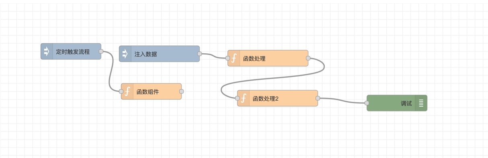

## 编程范式

编程范式是一种编程思想或方法论，用于指导程序员在解决问题时的思考方式和代码组织方式。它们定义了程序的结构、数据的处理方式以及解决问题的方法。

编程范式可以看作是一种编程的哲学或理念，它们提供了一套共同的原则和规则，帮助程序员更有效地解决问题和开发软件。

不同的编程范式强调不同的概念和技术，例如面向过程编程强调过程和函数的顺序执行，面向对象编程强调对象的封装和继承，函数式编程强调函数的纯粹性和不可变性等。

常见的编程范式包括：

- 命令式编程（Imperative Programming）：它通过一系列的命令或语句来描述程序的执行步骤。在命令式编程中，程序员需要明确地指定程序的每个细节，包括数据的存储、计算的顺序以及控制流程。

- 面向过程编程（Procedural Programming）：以过程或函数为基本单位，通过顺序执行一系列操作来解决问题。

- 面向对象编程（Object-Oriented Programming，OOP）：将问题分解为对象的集合，每个对象具有属性和方法，通过对象之间的交互来解决问题。

- 函数式编程（Functional Programming）：将计算视为函数的求值过程，强调函数的纯粹性和不可变性，避免副作用。

- 逻辑编程（Logic Programming）：基于逻辑推理和规则的编程范式，通过定义事实和规则，让计算机自动推导出解决方案。

- 声明式编程（Declarative Programming）：描述问题的性质和约束，而不是指定如何解决问题，让计算机自动推导出解决方案。

不同的编程范式适用于不同的问题和场景，选择合适的范式可以提高代码的可读性、可维护性和性能。在实际开发中，选择合适的编程范式可以根据问题的性质、开发团队的经验和技术要求等因素来决定，通常都会结合多种编程范式来解决复杂的问题，以充分发挥各种范式的优势。

##  命令式编程（Imperative Programming）

> 命令式编程（Imperative Programming）：它通过一系列的命令或语句来描述程序的执行步骤。在命令式编程中，程序员需要明确地指定程序的每个细节，包括数据的存储、计算的顺序以及控制流程。

命令式编程的核心思想是将程序视为一系列的指令，这些指令按照特定的顺序执行，从而实现程序的功能。程序员需要使用特定的编程语言来编写这些指令，通常包括变量声明、赋值语句、条件语句和循环语句等。

在命令式编程中，程序的执行顺序是显式指定的。程序从顶部开始执行，按照代码的顺序逐行执行，直到遇到条件语句或循环语句等控制流程语句。这些控制流程语句可以改变程序的执行路径，使程序能够根据不同的条件做出不同的决策。

命令式编程的一个重要特点是状态的改变。程序中的变量可以被赋予不同的值，从而改变程序的状态。这种状态的改变可以通过赋值语句来实现，程序员可以根据需要修改变量的值，以达到所需的计算结果。

以我们前端开发中的菜单高亮为例，现在需要根据当前用户所在的路由Path，找出应该高亮的菜单项。

```javascript
    let menu = [
            {
                label: '用户管理',
                index: 'user'
            },
            {
                label: '订单管理',
                index: 'order'
            },
            {
                label: '统计分析',
                index: 'statistic'
            }
        ];
    let activeMenu = null;
    
    let currentPath = 'user';
    for(let i = 0; i < menu.length; i++){
        if(menu[i].index === currentPath){
            activeMenu = menu[i];
            break;
        }
    }
    console.log(activeMenu)


    let currentPath = 'order';
    for(let i = 0; i < menu.length; i++){
        if(menu[i].index === currentPath){
            activeMenu = menu[i];
            break;
        }
    }
    console.log(activeMenu)
```
可以看到，命令式编程自顶而下顺序执行代码，其中包含变量的声明，变量的赋值，for循环和break，if条件判断等。

命令式编程的优点是直观和易于理解。由于程序的执行顺序是明确的，程序员可以清楚地知道每个语句的执行顺序和效果。这使得调试和修改程序变得相对容易。

但是命令式编程的代码通常比较冗长，需要大量的语句来描述程序的执行步骤，就像上面这个示例，由于没有把计算过程抽象出来，会有部分代码重复。


## 面向过程编程（Procedural Programming）

> 面向过程编程（Procedural Programming）将程序分解为一系列的过程或函数，每个过程都是一组有序的操作步骤，用于解决特定的问题。面向过程编程强调程序的执行顺序和控制流程，通过按照一定的顺序调用过程来实现程序的功能。

在面向过程编程中，程序的主要组成部分是过程或函数。过程是一组有序的语句块，用于执行特定的任务。这些过程可以接受输入参数，并返回输出结果。程序通过按照一定的顺序调用这些过程来实现特定的功能。

仍然以上面获取高亮菜单项为例，面向过程的实现如下：

```javascript
    function getActiveMenu(menu, currentPath) {
        let activeMenu = null;
    
        for (let i = 0; i < menu.length; i++) {
            if (menu[i].index === currentPath) {
                activeMenu = menu[i];
                break;
            }
        }
        return activeMenu
    }

    let menu = [
        {
            label: '用户管理',
            index: 'user'
        },
        {
            label: '订单管理',
            index: 'order'
        },
        {
            label: '统计分析',
            index: 'statistic'
        }
    ];
    
    console.log(getActiveMenu(menu, 'user'));
    console.log(getActiveMenu(menu, 'order'));
```

在这个示例中，我们封装了一个getActiveMenu函数，该函数入参为menu和当前路由path，返回高亮的菜单项，可以看出，相比命令式编程，面向过程编程将一组操作步骤封装成一个过程，使得这些操作可以被多次调用，提高了代码的可重用性。

面向过程编程将数据和过程分离，过程只关注如何处理数据，而不关心数据的具体内容，就像上述实现，函数getActiveMenu和要处理的数据menu是分开的，二者是独立存在的。

面向过程编程的应用范围广泛，特别适用于解决一些简单的问题或需要高效执行的任务，我们平时写的大部分代码都在面向过程编程。然而，面向过程编程也存在一些限制，例如难以处理复杂的问题、代码可读性较差等。因此，在处理复杂问题或需要更高级的功能时，通常会选择其他编程范式，如面向对象编程。

## 面向对象编程（Object-Oriented Programming，OOP）

> 面向对象编程（Object-Oriented Programming，简称OOP）它将程序中的数据和操作数据的方法组织成对象，通过对象之间的交互来实现程序的功能。

判断需不需要进行面向对象编程有个特别简单的方法，那就是看有没有数据以及对数据的处理函数，有数据有方法，就可以封装为对象。

仍然以上述获取高亮菜单为例，我们可以封装一个Menu对象，它有一个menuList属性用来存储原始菜单数据，对外提供一个getActiveMenu方法用来获取高亮菜单。

```javascript
    class Menu {
        menuList = []
        constructor(menuList) {
            this.menuList = menuList;
        }
        getActiveMenu(currentPath){
            let activeMenu = null;

            for(let i = 0; i < this.menuList.length; i++){
                if(this.menuList[i].index === currentPath){
                    activeMenu = this.menuList[i];
                    break;
                }
            }
            return activeMenu
        }
    }
    
    let menu = [
        {
            label: '用户管理',
            index: 'user'
        },
        {
            label: '订单管理',
            index: 'order'
        },
        {
            label: '统计分析',
            index: 'statistic'
        }
    ];


    let menuInstance = new Menu(menu);
    console.log(menuInstance.getActiveMenu('user'));
    console.log(menuInstance.getActiveMenu('order'));
```

可以看出，一旦对象实例构造成功，后续的调用非常简单，不需要重复传递菜单列表数据，后续如果有对菜单的其他操作，也可以封装到对象内部。
 
像这种把菜单相关的数据及各种操作都封装到Menu对象内部的做法，就是面向对象编程的核心特点：封装（Encapsulation）。对象提供接口供外部访问和操作数据，隐藏了对象的内部细节，封装提高了数据的安全性和代码的可维护性。

除了封装，面向对象还有两个重要的特性：继承和多态。

通过继承机制，一个类可以从另一个类派生出来，继承了父类的属性和方法，并可以在此基础上进行扩展或修改。继承可以实现代码的重用和扩展，减少了代码的冗余性。

不过目前普通认为继承会引起深度耦合，推荐通过多个对象组合替代继承。

多态允许子类可以重新父类的某些方法，允许不同的对象对同一消息做出不同的响应，提高了代码的灵活性和可扩展性。

### 面向对象编程优势

- 适合大型应用开发

相较于面向过程编程，面向对象编程更适于编写出复杂的应用，我们熟知的前端第三方库大部分都是基于面向对象编程的，如Vue、React、jQuery、ECharts等等，在实现一个较大的功能时，可以考虑应该抽象出几个对象，每个对象的功能是什么，有哪些属性和方法，对象之间如何调用，然后依次去实现每个对象。

就像我之前开发的一个流程驱动引擎SF.js，它用来渲染类似工作流、业务流等流程图，流程图最终可以通过序列化保存成一个json结构存储起来， 后续再通过该引擎反序列化json数据到画布上。



[SF.js源码](https://github.com/501351981/simple-flow-web)

在进行这个js库开发的时候，我就抽象出来了以下几个类：

**GraphView**：画布模型，负责画布相关的处理，包括初始化画布、事件绑定、快捷键绑定

**DataModel**：数据模型，负责图纸序列化/反序列化，添加、删除节点、添加连线，遍历节点，根据id获取节点信息等， 通过对dataModel操作，实现画布的渲染，一般不直接操作GraphView

**SelectionModel**：选择模型，负责管理节点选中相关操作，单选、全选、取消选择、获取当前选中节点等

**HistoryManager**：历史管理模型，负责存储操作记录，支持undo和redo

**Node**：节点模型，设置节点宽高/位置、业务属性、画布上的渲染（draw和redraw）

**Wire**：连线模型，负责节点之间的连线在画布上渲染（draw和redraw）

在进行开发之初，先定义好每个类的接口，然后逐个类进行开发调试，最后再把各个类组装到一起，如果没有采用面向对象的思想进行这种抽象和封装，相信是很难开发出这种稍大型的应用的，而且抽象出来的数据模型类DataModel和历史管理类HistoryManager也可以很容易用到其他图形化项目中，复用性也很强。


- 调用更简单

在对象实例化之后，不需要再反复传递一些数据，可以简化方法的调用。

以jQuery为例，在通过选择器构造出jQuery对象后，可以连续调用其方法，不用每次都传递选择器参数，非常的简便。

```javascript
$("#myDiv")
      .css("background-color", "yellow")
      .fadeOut(2000)
      .fadeIn(2000)
      .slideUp(1000)
      .slideDown(1000);
```

而如果没有采用这种面向对象的方式构造jQuery而是提供一个一个的方法，可能的调用方式应该是这样的。
```javascript
css("#myDiv", "background-color", "yellow");
fadeOut("#myDiv", 2000);
fadeIn("#myDiv", 2000);
slideUp("#myDiv", 1000);
slideDown("#myDiv", 1000);
```
二者的易用性高下显而易见。

以后再开发一些大型类库时，试试用面向对象方式进行思考吧。


## 函数式编程（Functional Programming）

> 函数式编程将计算视为数学函数的求值过程，在函数式编程中，函数被视为一等公民，可以作为参数传递给其他函数，也可以作为返回值返回。函数式编程强调使用纯函数，即没有副作用的函数，它们只依赖于输入参数并产生确定的输出结果。

### 函数是一等公民

一等公民意味着在编程语言中，函数可以像其他数据类型一样被操作和使用，具体包括以下几个方面。

- 函数可以被赋值给变量：可以将函数赋值给变量，使得变量成为函数的引用。

```javascript
const add = (a, b) => a + b;
const myFunction = add;
console.log(myFunction(2, 3)); // 输出 5
```

- 函数可以作为参数传递：可以将函数作为参数传递给其他函数

```javascript
const multiply = (a, b) => a * b;
const calculate = (fn, a, b) => fn(a, b);
console.log(calculate(multiply, 2, 3)); // 输出 6
```

- 函数可以作为返回值返回：可以在函数内部定义并返回另一个函数。


```javascript
const createAdder = (x) => {
  return (y) => x + y;
};
const add5 = createAdder(5);
console.log(add5(3)); // 输出 8
```

- 函数可以存储在数据结构中：可以将函数存储在数组、对象等数据结构中。

```javascript
const functions = [
  (a, b) => a + b,
  (a, b) => a - b,
  (a, b) => a * b
];
console.log(functions[0](2, 3)); // 输出 5
```

函数作为一等公民的概念使得函数可以像其他数据类型一样被操作和传递，这为函数式编程提供了强大的能力。它使得我们可以更灵活地组织和抽象代码，实现更高级的编程技巧，如高阶函数、函数组合和柯里化等。同时，函数作为一等公民也促进了代码的可读性、可维护性和可测试性。


### 纯函数

所谓纯函数就是指在相同的输入条件下，总是返回相同的输出结果，并且不会对外部环境产生任何副作用的函数。纯函数不会修改传入的参数，也不会改变全局变量或者调用其他不纯的函数。它们只依赖于输入参数，而不依赖于外部的状态或者数据。

纯函数有以下特点。

**1. 输入不变输出不变**

比如一个加法函数，无论什么时候调用，无论调用多少次，只要输入确定了，你总能轻易的预料到输出。
```javascript
function add(a,b){
    return a + b
}
```
类似于数学中的函数 f(x) = 2*x + 1，x给定了f(x)也是确定的。

**2. 不依赖外部，只依赖参数**

纯函数的输入只来自参数，而不会使用全局变量或者外部变量

下面的函数就不是纯函数，依赖了外部变量
```javascript
let sum = 0
function add(a,b){
    return sum + a + b
}
```

**3. 纯函数没有副作用**

副作用包含很多，比如
- 修改参数
- 修改全局量的值或者外部变量
- 进行网络请求
- 进行dom的操作
- 进行定时器的调用

比如以下这个就不是纯函数，因为它修改了参数
```javascript
function addItem(arr, item){
    arr.push(item)
}
```

这样就是纯函数，或者深度克隆arr再push也可以
```javascript
function addItem(arr, item){
    return [...arr, item]
}
```

在实际编程中，肯定不能做到100%全是纯函数，但是我们应该加大纯函数的占比，尽量编写纯函数。

纯函数是最让人放心的函数，它不玩魔术，就像数学中的函数一样，只要给定同样的输入，必然给出同样的输出，纯函数是可信赖的，由于它的这些特性，让代码的可读性更好。


## 逻辑编程（Logic Programming）

> 逻辑编程基于数理逻辑和形式逻辑的原理，通过定义事实和规则来描述问题的解决方法。在逻辑编程中，程序员不需要指定具体的计算步骤，而是描述问题的逻辑关系，由系统自动推导出解决方案。

逻辑编程的核心是谓词逻辑，它使用谓词来描述事实和规则。事实是描述问题中的已知信息，而规则是描述问题的逻辑关系。通过使用逻辑推理，系统可以根据已知的事实和规则来推导出问题的解决方案。

逻辑编程的一个常见的实现是Prolog语言。Prolog提供了一种声明式的编程风格，程序员只需要描述问题的逻辑关系，而不需要指定具体的计算步骤。Prolog系统会自动进行逻辑推理，从而得到问题的解决方案。

逻辑编程在人工智能、专家系统、自然语言处理等领域有广泛的应用。它提供了一种灵活的编程范式，可以用于解决复杂的问题，并且可以方便地与其他编程范式结合使用。

下面是一个简单的Prolog例子，展示了逻辑编程的特点。

假设我们要解决一个谜题：有三个人，他们分别是Alice、Bob和Charlie。我们知道以下几个事实：

- Alice是Bob的姐姐。
- Charlie是Alice的兄弟。

现在我们想通过Prolog来推导出这三个人的关系。

```text
% 定义事实和规则
sister(Alice, Bob).
brother(Charlie, Alice).

% 定义规则：如果X是Y的姐姐，那么Y是X的兄弟。
brother(Y, X) :- sister(X, Y).

% 查询兄弟关系
?- sister(Alice, Bob).
?- brother(Charlie, Alice).
```

在这个例子中，我们首先定义了两个事实： sister(Alice, Bob)表示Alice是Bob的姐姐， brother(Charlie, Alice)表示Charlie是Alice的兄弟。

然后，我们定义了一个规则：如果X是Y的姐姐，那么Y是X的兄弟。这个规则使用了逻辑推理，通过查询姐姐关系来得到兄弟关系。

最后，我们可以通过查询 sister(Alice, Bob)和 brother(Charlie, Alice)来验证这些关系是否成立。Prolog系统会根据已知的事实和规则进行推理，并返回查询结果。

当然上述示例我们也可以通过javascript来实现：
```javascript
// 定义事实和规则
const knowledgeBase = [
  { sister: ['Alice', 'Bob'] },
  { brother: ['Charlie', 'Alice'] }
];

// 定义规则：如果X是Y的姐姐，那么Y是X的兄弟。
function brother(Y, X) {
  for (const fact of knowledgeBase) {
    if (fact.sister && fact.sister[0] === X && fact.sister[1] === Y) {
      return true;
    }
  }
  return false;
}

// 查询兄弟关系
console.log(brother('Alice', 'Bob'));
console.log(brother('Charlie', 'Alice'));
```

这个JavaScript实现模拟了Prolog中的逻辑推理过程，通过定义事实和规则，并进行遍历和匹配，来得出问题的解决方案。尽管这只是一个简化的示例，但它展示了如何使用JavaScript来实现逻辑编程的思想。当然，这种实现方式可能不如专门的逻辑编程语言（如Prolog）高效和灵活。

## 声明式编程（Declarative Programming）

> 声明式编程是一种编程范式，其中程序员描述了所需的结果，而不是指定如何实现它。在声明式编程中，程序员将重点放在描述问题的逻辑和约束上，而不是详细说明解决问题的步骤

我们最常用的HTML和CSS代码编写就属于声明式编程，我们可以通过HTML声明一个网页中包含哪些元素，通过CSS描述指定元素的样式，HTML和CSS本身并不负责将元素渲染到页面上，他们只是描述想要的结果，浏览器根据HTML和CSS内容，负责将其渲染到屏幕上。

SQL也属于一种声明式编程语言，当使用SQL查询数据库时，我们可以使用声明式编程的方式来描述我们需要的数据，而不需要关心具体的查询过程。

例如，假设我们有一个名为"users"的表，其中包含用户的姓名、年龄和所在城市。我们想要查询所有年龄大于等于18岁的用户，并按照姓名的字母顺序进行排序。

在声明式编程中，我们可以使用以下SQL查询语句来实现：

```text
SELECT * FROM users WHERE age >= 18 ORDER BY name ASC;
```

声明式编程具有以下优点：

- 可读性高：声明式编程更接近自然语言，代码更易于理解和阅读。程序员可以更容易地理解代码的意图和逻辑。

- 可维护性高：由于声明式编程关注于描述问题的逻辑和约束，而不是实现细节，因此代码更易于维护。当需求变化时，只需修改描述，而不需要修改实现步骤。

- 代码复用性高：声明式编程鼓励将逻辑和约束抽象为可重用的组件或函数。这样可以减少重复代码的编写，提高代码的复用性。

- 抽象级别高：声明式编程提供了更高的抽象级别，使程序员能够更容易地表达复杂的逻辑和约束。这使得代码更简洁、可读性更高，减少了出错的可能性。

然而，声明式编程也有一些缺点：

- 灵活性受限：声明式编程通常更适用于解决特定类型的问题，而对于一些需要精确控制和灵活性的问题，可能不太适用。在某些情况下，命令式编程可能更灵活和高效。

- 学习曲线较陡：对于习惯于命令式编程的开发人员来说，学习和适应声明式编程的思维方式可能需要一些时间和努力。

- 性能问题：在某些情况下，声明式编程可能会导致性能问题。由于程序员不直接控制实现细节，可能无法对性能进行优化。

总之，声明式编程的优势在于它提供了一种更简洁、可读性更高的方式来描述问题和需求，而不需要关注具体的实现细节。

## 总结

- 命令式编程自顶而下顺序执行代码，优点是直观和易于理解，缺点是冗长、重复。
- 面向过程编程的核心是抽取函数，通过调用函数完成特定任务，适合解决简单的问题
- 面向对象编程将数据和数据的操作方法抽象为对象，适合大型应用开发；面向对象编程有三个重要特性：封装、继承、多态；
- 函数式编程的核心是将函数视为一等公民，推荐使用纯函数；一等公民意味着在编程语言中，函数可以像其他数据类型一样被操作和使用；纯函数是指在相同的输入条件下，总是返回相同的输出结果，并且不会对外部环境产生任何副作用的函数
- 逻辑编程中程序员不需要指定具体的计算步骤，而是描述问题的逻辑关系，由系统自动推导出解决方案
- 声明式编程中描述所需的结果，而不指定如何实现它，程序员将重点放在描述问题的逻辑和约束上，而不是详细说明解决问题的步骤