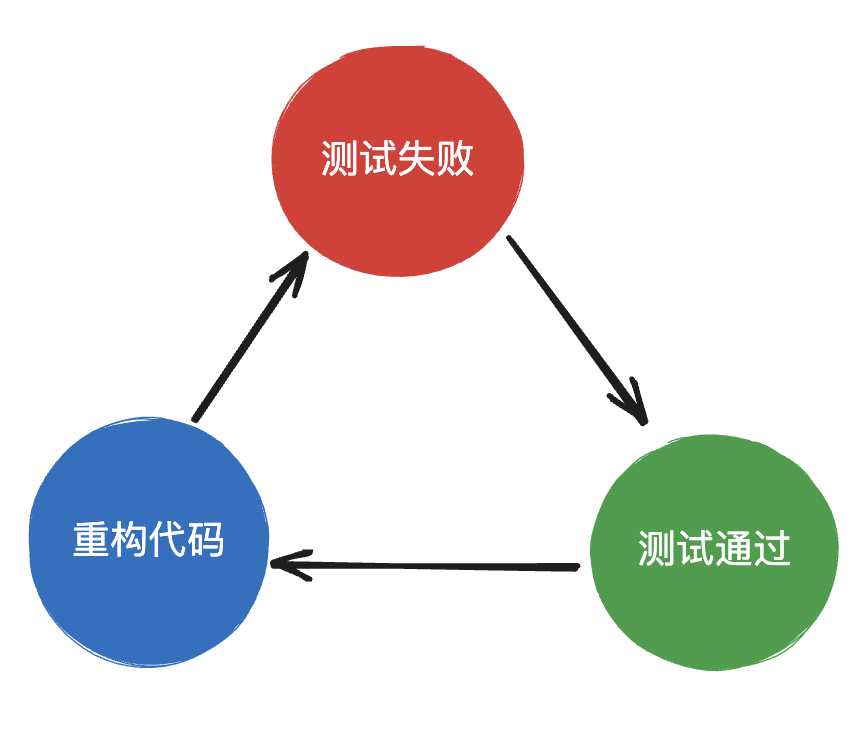

# 测试驱动开发TDD

TDD（Test-Driven Development，测试驱动开发）是一种软件开发方法论，它强调在编写代码之前先编写测试用例。TDD的核心思想是通过编写测试用例来驱动代码的开发，以确保代码的正确性和可靠性。

## 使用TDD方式开发lodash的get方法

先不说太多理论性的东西，我们通过一个示例来体会下测试驱动开发的优势。

假设我们现在开发一个类似lodash的js库，其中有一个get方法，可以通过key来安全获取对象或者数组的某个属性值，通过TDD的大致开发流程如下。

首先导出get方法，什么都不需要实现，只实现一个get方法的空壳。

//lodash.js
```javascript
function get(object, path, defaultValue){
    return;
}


module.exports = {
    get
}
```
接下来开始编写第一条测试用例，期望调用get(obj, 'a')能够获取对象obj的a属性的值。

//get.test.js
```javascript
const get = require('./lodash').get;

describe("get方法测试", () =>{
    it('对象测试', () =>{
        let obj = {
            a: 1
        }
        expect(get(obj, 'a')).toBe(1)
    })
})
```
接下来执行这个测试用例，这里可以使用任意的测试库来执行这个测试用例，我一般习惯使用jest进行单元测试，使用什么库都无所谓，不影响TDD这种开发思想。

不出意外，这条测试用例失败了，因为我的get方法目前还没有任何实现，为了让这个测试用例通过，我只需要简单的修改get方法即可。

```javascript
function get(object, path, defaultValue){
    return object[path];
}
```

再次执行测试用例，ok，通过了，至此围绕第一条测试用例的开发结束了，是不是特别简单，简直让人信心大增。

接下来继续添加测试用例，我们期望get方法不仅能获取对象的子属性，还能获取更深层次的属性，如get(obj, 'b.c')。

```javascript
const get = require('./lodash').get;

describe("get方法测试", () =>{
    it('对象测试', () =>{
        let obj = {
            a: 1,
            b: {
                c: 2
            }
        }
        expect(get(obj, 'a')).toBe(1);
        //新增一条测试用例
        expect(get(obj, 'b.c')).toBe(2)
    })
})
```
执行测试用例，不出意外地又出错了，没关系，继续重构我们的get方法即可，检测path中是否包含字符'.'，如果包含则递归获取对象的值。

```javascript
function get(object, path, defaultValue){
    if(!path.includes('.')){
        return object[path];
    }
    let attrArr = path.split('.');
    let firstAttr = attrArr.shift();
    return get(object[firstAttr], attrArr.join('.'));
}

module.exports = {
    get
}
```

虽然写的时候感觉上述实现可能不太完美，或者有潜在的bug，不过也不用太在意，后面我们再根据各种边界相关的测试用例补全实现即可，现在先把第二条测试用例通过再说。

再次执行测试用例，很好，又通过了，至此我们的实现已经成功支持2条测试用例了。

接下来我们可以继续添加测试用例--》执行测试得到失败反馈--》重构代码让测试通过，如此循环往复，最终实现一个满足了各种情形的get方法。

开发完之后，如果你觉得代码写的不够满意，可以重构你的代码，不用害怕重构中会带来bug，你可以修改个3、5行之后就执行一次测试用例，看看这次的修改是不是能让全部测试用例通过，通过则说明没有引入新问题，继续重构就行，如果有测试用例没通过则可以检查下原因，实在不行撤回这几行的变更换个思路修改就行。

是不是很棒，再也不用提心吊胆地去修改代码了，TDD让你重拾对代码的掌控感！

## TDD开发步骤

这就是TDD开发的一个经典流程：



- 不可运行（测试失败）：写一个功能最小完备的单元测试，并使得该单元测试编译失败。
- 可运行（测试通过）：快速编写刚刚好使测试通过的代码，不需要考虑太多，甚至可以使用一些不合理的方法。
- 重构：消除刚刚编码过程引入的重复设计，优化设计结构
- 重复以上步骤

TDD的开发流程是一个持续迭代的过程，通过不断编写测试用例、实现代码和重构代码，逐步构建出高质量的软件系统。这种流程强调了测试的重要性，并将测试作为开发的驱动力，以确保代码的正确性和可靠性。

千万不要认为只要测试用例通过就行了，测试用例通过是最低标准，TDD的核心一环是重构，不断地优化代码结构并通过测试，帮助你编写出更高质量的代码。

## TDD开发优势

### 目标感更强

开发中应该先写测试用例还是先进行代码实现呢？

就像我们平时做事，你是做事之前先定目标，然后再去行动，还是先去行动，然后干到哪算哪呢？这代表两种不同的行为模式，先理清楚目标再去行动，相对来说效率更高，也不容易跑偏。而测试用例就是我们要实现的一个个目标。

很多同学接到任务之后就闷头去干，想尽快进入编码阶段，忽视需求分析，结果就是在编码后花费N倍的时间去优化、改Bug、甚至推倒重来。如果你问他为什么这么做，他会说项目紧急我没时间设计，但是这样真的让项目进度提前了吗？未必！我们经常一边抱怨没时间，一边花费巨量的时间去偿还技术债。

> 项目开发成本 = 设计花费的成本 + 编码的成本 + 维护的成本

TDD模式开发要求我们先编写测试用例，先制定软件的开发目标，然后再慢慢去实现。有了测试用例，可以先拿着测试用例去评审，看看用例有没有缺失，要实现的功能是不是符合需求，这样就能在开发前期尽快发现设计上的不足。

这里注意一点，测试用例我们可以提前写很多，但是在开发阶段最好一个一个去实现，先把其他暂时不实现的用例注释掉，避免上来N个测试用例都失败，导致开发时无从下手。

### 小步快跑

从上面我们实现lodash的get方法的过程中可以看出，采用TDD开发并不要求一上来就编写非常优雅的代码，而是仅仅要求你能让一个测试用例通过即可，这相对来说简单很多。

通过这种方式，我们可以先将一个复杂的任务拆分成多个简单的测试用例，然后逐个击破，这更能激发人的信心，也利于评估工作的进度，要不领导问你开发咋样了，之前你只能说快了，开发大部分了，现在你可以说，一共100条测试用例，我已经通过97条了。


### 大胆重构

如果你觉得之前代码写的不够优雅，但是能用，你敢重构吗？是不是担心重构之后引入新的bug？这时你可能会退缩了，怕没有功劳却背一口大锅。

或者说你现在接手一个复杂的项目，比如现在让你维护lodash，现在需要修改一个bug，你会不会改起来如履薄冰，生怕一个失误，影响到成千上万的人。

有了TDD，这些都不再是问题，你可以放心大胆的去改，只要改完之后运行一下测试用例，看看测试用例是否全部通过，通过了即可认为没有引入新的bug，你这次的修改是成功的，这无疑会增加我们重构代码的动力，再也不用畏畏缩缩、如履薄冰了，这样的开发体验简直太棒了！


### 提升代码质量

TDD会在多个环节帮助你提升代码质量：
- 编码前检查设计缺陷：通过评审或者自查测试用例，就能快速发现功能设计的漏洞，通过编写完备的测试用例，可以确保功能完全满足开发需求。

- 重构代码：有了TDD可以放心大胆地重构旧代码，写出更加可读、复用性更强、更加解耦的高质量代码
- 避免维护时引入新bug：每次维护代码后，只要一条命令运行全部测试用例，就能判断是否引入了新bug，避免因为考虑不全面，发生改一个bug引入两个bug的尴尬情况发生。


## 总结

TDD是一种非常有效的提升开发效率和代码质量的开发方式，非常适用于开发一些前端底层库，或者基础组件。

TDD开发过程循环往复三个过程：编写测试用例并让测试用例执行失败、编写刚刚好的代码让用例通过、重构代码提升代码质量。

TDD模式开发能够提升开发前的目标感，在开发前发现设计缺陷，也可以通过测试用例通过率衡量开发进度；通过将复杂的任务拆分成一个一个可完成的小的测试用例，减低了开发难度；TDD可以提升重构和维护时的信心，可以更加放心大胆地去优化你的代码，最终提升代码质量。

TDD和普通的前端测试不同，TDD是开发前先写测试用例，通过测试用例驱动开发，而不是事后补充测试用例，当然了能事后补充测试用例，也不失是一个亡羊补牢的方式。


