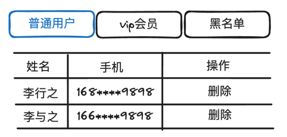

# 策略模式

假设现在需要你开发一个获取用户列表的方法getUser，要求是可以对用户列表进行排序，排序方式要支持姓名、创建时间和所属部门的升降排序，现在先花一分钟时间思考下，如何实现这个getUser方法呢，getUser方法的参数是什么？

从需求来看，getUser应该需要两个参数：排序字段sortKey(name|createTime|department)、排序方式sortDirection(asc|desc)，我们先按这个思路实现下。

```javascript
function getUser(sortKey, sortDirection){
    //忽略通过请求获取用户数据相关代码
    let users = [
        {name: '用户1', createTime: '2023-10-1', department: '前端部'},
        {name: '用户2', createTime: '2023-10-2', department: '后端部'},
    ];
    
    switch (sortKey){
        case 'name':
            if(sortDirection === 'asc'){
                //按照名称升序排序
            }else{
                //按照名称降序排序
            }
            break;
        case 'createTime':
            if(sortDirection === 'asc'){
                //按照创建时间升序排序
            }else{
                //按照创建时间降序排序
            }
            break;
        case 'department':
            if(sortDirection === 'asc'){
                //按照部门升序排序
            }else{
                //按照部门降序排序
            }
            break;
    }
    return users;
}

getUser('name', 'asc'); //按照名称升序获取用户
getUser('createTime', 'desc'); //按照创建时间降序获取用户
```

这样实现可以满足需求，但是也存在一些可读性和可维护性方面的问题

首先是这样的代码可读性较差，体现在两个方面，第一个点是getUser函数中充斥着大量的分支语句(switch、if)，每个分支都会增加阅读的成本，分支越多，嵌套分支越深，理解起来就越困难；第二个点是排序部分所占的代码比重在getUser函数中过高，有点头轻脚重的感觉，代码不够结构化。

在可维护性方面，后续如果要增加一些新的排序方式，你就必须要先理解getUser方法的实现原理，然后再修改getUser方法中关于排序的实现，别小看这个修改，虽然你只是想修改排序部分，但是难保不会引入新的bug，毕竟你是在修改同一个函数。

能不能将排序实现抽出去呢？不同的排序可以看成不同的算法或者策略，我们在调用getUser方法时传递想要的排序策略不就可以了吗，按照这个思路修改下：

```javascript
const nameAscStrategy = function (users){  }; //按照名称升序排序
const nameDescStrategy = function (users){  }; //按照名称降序排序
const createTimeAscStrategy = function (users){  }; //按照创建时间升序排序
const createTimeDescStrategy = function (users){  }; //按照创建时间降序排序
const departmentAscStrategy = function (users){  }; //按照部门升序排序
const departmentDescStrategy = function (users){  }; //按照部门降序排序


function getUser(sortStrategy){
    //忽略通过请求获取用户数据相关代码
    let users = [
        {name: '用户1', createTime: '2023-10-1', department: '前端部'},
        {name: '用户2', createTime: '2023-10-2', department: '后端部'},
    ];
    
    return sortStrategy(users);
}

getUser(nameAscStrategy); //按照名称升序获取用户
getUser(createTimeDescStrategy); //按照创建时间降序获取用户
```

现在我们再来看看getUser方法的实现，是不是瞬间清爽了很多！里面不再有让人讨厌的分支语句了，可以说非常地优雅~~后续再有新的排序方式，也不需要修改getUser方法，只需要创建一个新的排序策略即可。

为了让策略更加高内聚，我们可以将所有策略集中放到一个对象下。

```javascript
const SORT_STRATEGY = {
    nameAsc: function (users){},
    nameDesc: function (users){},
    createTimeAsc: function (users){},
    createTimeDesc: function (users){},
    departmentAsc: function (users){},
    departmentDesc: function (users){}
}
function getUser(sortStrategy){
    //忽略通过请求获取用户数据相关代码
    let users = [
        {name: '用户1', createTime: '2023-10-1', department: '前端部'},
        {name: '用户2', createTime: '2023-10-2', department: '后端部'},
    ];

    return sortStrategy(users);
}

getUser(SORT_STRATEGY.nameAsc); //按照名称升序获取用户
getUser(SORT_STRATEGY.createTimeDesc); //按照创建时间降序获取用户

```

上述这种优化方式，就是一种策略模式，接下来我们看下策略模式的定义。

## 策略模式定义

> 策略模式（Strategy Pattern）允许在**运行时**根据不同的情况选择不同的算法或策略。该模式将算法或策略封装起来，使得它们可以**相互替换**，此模式可以让算法的变化**隔离于**使用算法的客户之外。

在这个定义中，我们重点关注几个关键词：

- 运行时：运行时意味着可以动态替换策略，比如上述getUser方法，你可以根据情况使用不同的策略，而不是提前固定好的。

```javascript
getUser(SORT_STRATEGY[sortMethod])
```

- 相互替换：多个策略遵循相同的接口，如果策略是一种类，那就有相同的属性和方法；如果策略是个函数，那么就有相同的形参和返回值。

- 隔离变化：策略模式的目的就是隔离算法的变化，将变化的算法抽取到策略中，将不变的部分留在调用策略的客户中。

在策略模式中，通常会定义一个抽象策略接口，所有具体策略类都实现该接口。客户端通过调用策略接口的方法来执行具体的算法。在运行时，可以根据需要动态地切换不同的策略，而不需要修改客户端的代码。

在前端实际开发中，可能很少用到接口，我们可以理解为将策略抽取到一个策略对象当中，每个策略函数遵循同样的参数和返回值规范。这种规范，就可以理解为后端的接口interface。

## 策略模式示例

策略模式的应用很广泛，比如咱们经常用的数组的sort、filter方法等，是不是都把排序策略和过滤策略抽象出来交给用户自行实现，通过这种方式大大提高了数组方法的适用场景。

为了加深对策略模式的理解，我们再举两个示例。

假设现在需要你实现一个搜索功能，要求是要将搜索结果进行缓存，以便于后续快速返回。

先来分析下这个需求，需求中提到了缓存，那使用何种缓存方式呢，内存、localStorage、sessionStorage还是IndexedDB，需求中没有明确说，假设都要支持，那如何设计呢？

我们可以将缓存方式设计成为一种策略，在搜索功能中配置某一种策略，这样即可轻松应对需求变化。

前面我们提到了，策略模式要求每个策略遵循同样的接口，作为缓存策略，我们很容易想到，每个策略应该至少包含以下几个方法：
```typescript
interface CacheStrategy {
    getCache(key: string): any | undefined;
    setCache(key: string, data: any): void;
    has(key: string): boolean;
}
```

接下来我们使用localStorage来实现这个接口

```typescript
class LocalStorageCacheStrategy implements CacheStrategy {
  getCache(key: string): any | undefined {
    const data = localStorage.getItem(key);
    if (data) {
      return JSON.parse(data);
    }
    return undefined;
  }

  setCache(key: string, data: any): void {
    localStorage.setItem(key, JSON.stringify(data));
  }

  has(key: string): boolean {
    return localStorage.getItem(key) !== null;
  }
}
```

通过内存进行存储的策略实现：
```typescript
class MemoryCacheStrategy implements CacheStrategy {
  private cache: { [key: string]: any } = {};

  getCache(key: string): any | undefined {
    return this.cache[key];
  }

  setCache(key: string, data: any): void {
    this.cache[key] = data;
  }

  has(key: string): boolean {
    return key in this.cache;
  }
}
```

接下来实现一个搜索类，在搜索类构造函数中接收一个存储策略，在搜索时调用先调用存储策略的has方法，看看搜索的关键词是否存在，存在则通过get方法获取缓存；如果搜索关键词不存在缓存中则进行搜索，并调用存储策略的set方法将搜索结果缓存。

```typescript
class Search {
  private cacheStrategy: CacheStrategy;

  constructor(cacheStrategy: CacheStrategy) {
    this.cacheStrategy = cacheStrategy;
  }

  search(query: string): void {
    // 检查缓存中是否存在搜索记录
    if (this.cacheStrategy.has(query)) {
      // 从缓存中获取搜索结果
      const results = this.cacheStrategy.getCache(query);
      return results;
    } else {
      // 执行搜索操作，获取搜索结果
      const results = this.performSearch(query);
      // 将搜索结果存储到缓存中
      this.cacheStrategy.setCache(query, results);
      return results;
    }
  }

  private performSearch(query: string): string[] {
    // 模拟搜索操作，返回搜索结果
    return [`Result 1 for ${query}`, `Result 2 for ${query}`, `Result 3 for ${query}`];
  }
}
```

后续实例化搜索类时，可以根据需要传递不同的存储策略。

```typescript
// 实例化使用内存策略的搜索类
const memoryCacheSearch = new Search(new MemoryCacheStrategy());
memoryCacheSearch.search("apple");
memoryCacheSearch.search("banana");
memoryCacheSearch.search("apple"); // 从缓存中获取搜索结果

// 实例化使用 localStorage 策略的搜索类
const localStorageSearch = new Search(new LocalStorageCacheStrategy());
localStorageSearch.search("apple");
localStorageSearch.search("banana");
localStorageSearch.search("apple"); // 从缓存中获取搜索结果
```

这样就将搜索功能和缓存策略隔离开来了，后续想增加IndexedDB存储，只需要新建一个策略即可，搜索类无需任何改动。

我们再看一个前端开发中，非常常见的页签功能实现。



在上述图中，我们可以通过切换页签查看不同类型的成员，不同成员的表格展示项也不完全相同，每个类型的成员都有删除操作，但是调用的接口不同。

如果没有使用策略模式，我们可能的实现如下（为了更清楚的看到策略模式的结构，我们忽略UI相关的代码，只写核心逻辑）。

```javascript

function getUsers(type){
    if(type === 'ordinaryUser'){
        //获取普通用户数据
    }else if(type === 'vip'){
        //获取Vip用户数据
    }else if(type === 'blackList'){
        //获取黑名单用户数据
    }
}

function deleteUser(type, userInfo){
    if(type === 'ordinaryUser'){
        //调用删除普通用户接口
    }else if(type === 'vip'){
        //调用删除Vip用户接口
    }else if(type === 'blackList'){
        //调用删除黑名单用户接口
    }
}
```
我们经常看到这种丑陋的代码，在多个函数中都进行某种类型判断，然后执行不同逻辑的代码，感觉非常的繁琐，能不能把这些分支判断去掉呢？当然了，我们可以通过策略模式来进行优化。

每个类型的用户策略中可以提供相应的getUsers和deleteUser方法，在业务中根据用户类型动态选择相应的策略，然后调用策略提供的方法。

```javascript
const userStrategy = {
    ordinary: {
        getUsers: function (){},
        deleteUser: function (userInfo){}
    },
    vip: {
        getUsers: function (){},
        deleteUser: function (userInfo){}
    },
    blackList:{
        getUsers: function (){},
        deleteUser: function (userInfo){}
    }
}


function getUsers(type){
    userStrategy[type].getUsers();
}

function deleteUser(type, userInfo){
    userStrategy[type].deleteUser(userInfo);
}
```

可以看到，用策略模式重构后的代码依然十分优雅，不同用户的操作内聚在一起，而且业务代码中消除了类型判断，无论是可读性还是可维护性都大大提升。


## 总结

- 当代码中充斥着大量重复的分支判断的时候，可以考虑试试策略模式
- 策略模式中的每个策略需要遵循相同的接口，策略之间可以互相替换
- 策略模式允许在运行时中动态分配策略
- 策略模式将策略的变化和调用方隔离开来，可以很方便地扩展策略，符合开闭原则
- 策略模式可以提升代码的可读性和可维护性，是一种非常常见的有效的设计模式