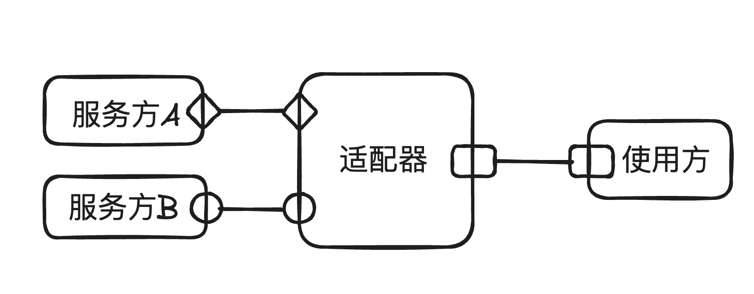

## 从电源适配器到代码适配器
提到适配器模式，我们首先想到的可能就是电源适配器，电源适配器的作用是转换电压，将电压转换成我们需要的电压。

我最近就发现了一个很好玩的电源适配器：电动车手机充电器，我们都知道，电动车的电池电压一般是48V，而手机充电电压一般是5V，所以电动车电池是不能直接给手机充电的，这时候就需要一个电源适配器，通过这个适配器将48V的电压转换成5V的电压，这样手机就可以充电了。有了它，相当于有了一个大号的充电宝，出门在外再也不担心手机没电了。


回到我们的前端开发中，也有很多场景需要用到适配器，比如你家后端接口中的所有时间字段都是ISO 8601格式的(例：2023-11-10T10:33:56)，但是在页面展示上，你们的UI设计师要求必须展示成这样"2023/11/10 10:33:56"，为了解决这个问题，你需要在每个用到时间的地方都写一个转换方法，这样工作量就很大了，换个思路，如果我们在获取到后端数据之后，直接做一下转换呢，直接转换成我们期望的格式不就好了，这样在UI渲染时就可以直接使用了。

```javascript
function timeAdaptor(data) {
    //将接口中的 创建时间和更新时间 格式化成我们想要的格式
    ['createTime', 'updateTieme'].forEach(key => {
        if (data[key]) {
            const date = new Date(createTime);
            const formattedTime = `${date.getFullYear()}/${date.getMonth() + 1}/${date.getDate()} ${date.getHours()}:${date.getMinutes()}:${date.getSeconds()}`;
            data[key] = formattedTime;
        }
    })
    return data;
}
```
这样，我们就可以在获取到后端数据之后，直接调用 timeAdaptor 方法，将时间格式转换成我们想要的格式，如果你们封装了自己的网络请求，可以在每个网络请求结束后自动进行这个转换，以后开发业务代码时再也不用考虑日期格式的转换了，是不是非常的nice。

## 适配器设计模式

首先看下适配器模式的定义

> 适配器模式是一种设计模式，它充当一个中间层，将一个类的接口转换成客户端所期望的另一个接口。适配器模式允许不兼容的接口之间进行协同工作，使得客户端能够使用不同接口的对象。

如下图所示，可能有多个服务方，每个服务方的接口各不相同，通过适配器可将其转为符合使用方要求的接口形式。



还有一种场景是服务方接口发生了变更，但是我们不希望修改现有的代码，这时可以增加一个适配器，通过封装和转换，使得客户端可以无缝地与新接口进行交互。

适配器模式通常包含以下3个角色：

目标接口（Target Interface）：客户端所期望的接口，适配器将现有的接口转换为目标接口。

适配器（Adapter）：适配器是一个具体的函数、类或对象，它实现了目标接口，并将客户端的请求委托给被适配的对象。

被适配者（Adaptee）：被适配者是现有的类或对象，它具有不兼容的接口，适配器将其接口转换为目标接口。

适配器模式的核心思想是通过适配器来解决不兼容的接口问题，使得不同接口的对象能够协同工作。

下面我们通过几个示例加深对适配器模式的理解。

### 适配器示例

### 前后端接口转换

相信大家在平时开发中都会对后端返回的数据进行格式化format，其实这就是一种适配器模式，将后端返回的数据结构改成我们前端期望的数据结构。

比如后端返回的是个对象结构，我们将其转为数组结构。

```javascript
let apiData = {
    user1: {name: 'li', age: 25},
    user2: {name: 'wang', age: 26},
};

function adaptData(apiData){
    return Object.keys(apiData).map(uid =>({
        uid,
        ...apiData[uid]
        
    }))
}

adaptData(apiData);
//[ {uid: 'user1', name: 'li', age: 25}, {uid: 'user2',name: 'wang', age: 26}]
```

这个示例并没有什么稀奇，就是大家日常在做的工作，还是最开始讲的那个示例更有意思，可以通过一个适配器，对所有接口返回的数据进行处理，比如进行日期格式转换等。

### 第三方数据转换

在我的开源库 [vue-office](https://github.com/501351981/vue-office) 中就有个真实的适配器模式应用示例。

事情是这样的，我想实现excel的带样式预览，但是我又不想从头开始完成这个功能，于是就找了一些第三方库。目前没有直接完成这个功能的库，每个库都只完成一部分功能，比如exceljs可以读取excel文件，将文件内容解析成一个对象；x-data-spreadsheet可以通过配置一个对象以excel的样式将数据渲染到浏览器中，但是问题是exceljs输出的数据格式和x-data-spreadsheet输入的数据格式并不相同，于是我就分析二者的数据格式，最终通过实现一个适配器，完成了excel的带样式渲染。

```javascript
//输入为 exceljs读取excel产生的对象
//输出为x-data-spreadsheet所需的对象
export function transferExcelToSpreadSheet(workbook, options){
    let workbookData = [];
    workbook.eachSheet((sheet) => {
        let sheetData = { name: sheet.name,styles : [], rows: {},cols:{}, merges:[],media:[] };

        // 收集合并单元格信息
        let mergeAddressData = [];
        for(let mergeRange in sheet._merges) {
            sheetData.merges.push(sheet._merges[mergeRange].shortRange);
        }
        //其他各种转换: 行列数据、样式等
        
        workbookData.push(sheetData)
    })
    
    return workbookData;
}
```

### 改造不合理的接口

老前端肯定都遇到这样的问题，明明我只想获取某个资源的详情，后端却让我调用3-4个接口才拿到全部数据，比如我要获取掘金文章的详情，前端期望一个接口拿到文章内容详情、作者名称、所属专栏名称还有文章标签名称等，但后端提供的文章详情接口中只是返回作者id、专栏id还有标签id，然后你还需要再调用其他3个接口才能拿到全部数据，使用非常的繁琐，而且耗时也长，如果你让后端改，他可能会说我这样复用性更强等等。

如果后端执意不改怎么办呢，这里有两个思路，第一种是增加node层适配接口，node层通过组合多个接口调用，为前端提供更加友好的接口结构，不过这种方式取决于公司的技术规范了，不一定都能行得通；另一种使我们封装一个适配器，将文章详情获取封装起来，简化我们的调用。

```javascript
function getArticleDetail(articleId){
    return request('文章url').then(res =>{
        let {userId, tagId} = res;
        //根据用户id和标签id 请求数据
        res.userInfo = {};
        res.tagInfo = {};
        
        return res;
    })
}
```

封装后，在业务中只需要传递文章id即可获取文章全部信息，如果有一天后端幡然醒悟了，修改成了更加友好的接口，我们也只需要在这里调整代码就行，不会影响其他业务代码。

## 总结

适配器模式是一种比较简单且容易理解的设计模式，通过创建适配器，可以兼容不同的数据结构或接口，通过这种兼容避免了对两方代码的修改，在一定程度上增强了目标接口和被适配接口的复用性。

