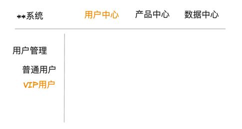

在产品设计评审中，往往会因为某个设计而争得面红耳赤，双方都觉得自己的设计才是最好的，谁也不服谁，最常听到的词莫过于"我认为"、"我觉得"、"我更喜欢"，这种以自我感受为评价标准的讨论是没法出结果的，每个人的感受都不完全一样，最后只能按照谁的权利大谁说的算草草结束最终的讨论。

我认为本质上还是缺少一套普世的评价原则，如果大家都在同一套原则基础上进行思考和对话，可能会更加理性和高效，当然了，美和好是无法完全定义的，这些原则也只能帮助我们避免犯一些低级错误，并不是创造成功产品的充分条件。

## 1. 突出重点

人类的认知和注意力是非常有限且宝贵的资源，我们无法同时处理大量的信息，因此，在设计中突出重点可以帮助用户更有效地获取和理解关键信息。

人类的注意力容易受到各种因素的干扰，如信息过载、复杂的界面、不相关的内容等。通过突出重点，可以引导用户的注意力，使其更容易注意到和理解重要的信息。这有助于用户快速找到所需的内容，减少认知负担，并提高用户体验。

下面是三种地图的首页，你能看出他们的重点吗？

很明显最右侧的图信息更少，更容易让人抓住重点，这个页面主要有3块元素：地图，搜索框、常用地点。

其中地图占据了屏幕绝大部分，是第一突出重点，这里通过占据大面积布局来突出重点。
第二重点是搜索输入框，通过接近全屏的宽度 + 反差的背景颜色来吸引人的注意力。

第三重点为常用地址，由于没有那么重要，布局上靠下，然后通过较大的按钮来突出这块功能。

整个界面按照人的视觉顺序（自上而下）依次展开，娓娓道来，主次分明。

当然了，可能由于最右侧这个地图没有进行商业化，所以内容更加简洁，重点也更突出，那么我们再来对比下第一和第二这两个商业化地图。

首先对比下地图区域的展示，图1中的地图被上层的三块元素分割开来，导致整个可视地图区域变小，布局上也很混乱，相比之下图2中将浮层元素统一居于右侧区域，漏出大片可视地图区域。

再来看下图1和图2的搜索输入框，可能图1中想重点展示输入框，所以放在的最顶部，但是由于整个界面都是白色背景，再加上混乱的布局，不容易让人看到，相比之下在我盯着地图时，正好可以看到中部的搜索输入框，而且在我单手握手机时，搜索输入框正正好好就落在我的大拇指之下，一切都是那么自然，而图1，要想搜索，我必须费劲的移动大拇指，或者采用双指操作。

接下来对比下服务导航区域，图1中所有的图标大小都是一样的，没有主次，而图2中重点突出第一排的5个服务，其他的则弱化。

两款地图默认都是展示了2排服务，只有用户通过上划操作时才展示更多服务，通过这种隐藏操作重点突出前两排服务。

通过上面这个示例，我们也能看到突出重点的几种常用方式：位置、大小、颜色、隐藏等。

### 通过位置突出重点

在大多数情况下，人们在阅读网页或文本时会形成一个"F"字形的阅读模式。首先，他们会从左上角开始，沿着水平线从左到右扫视，然后向下移动一行，再次从左到右扫视。这种模式在西方文化中较为常见。

在某些情况下，人们会形成一个"Z"字形的阅读模式。他们会从左上角开始，沿着水平线从左到右扫视，然后向下移动一行，再次从右到左扫视，最后再向下移动一行。

把要突出的重点内容放在人的视觉优先达到的地方，不要再这些重要位置放一些干扰性元素。

### 通过大小突出重点

大块的区域天然的更容易吸引人的注意力，对于重点内容可加大展示区域，增加字号，加粗字体。

对比下两款地图中评分和距离信息的展示，可以看出右图通过更大的区域和字体，把重点突出，整个展示更有层次。

### 使用空白和间距

通过使用空白和适当的间距，将重点内容与其他内容分隔开来。这样可以使重点内容在视觉上更加突出，减少干扰和混淆。

### 使用醒目的颜色

通过使用醒目的颜色，如鲜艳的色彩或与其他颜色形成鲜明对比的颜色，将重点内容与其他内容区分开来。这样可以在视觉上更加突出重点，并吸引用户的注意力。

多个操作按钮通过颜色突出主要操作或者用户使用频率最高的操作：

通过使用红色或者黄色等警告色，提醒用户关注一些潜在的危险风险：

### 运用视觉层次

通过运用视觉层次，将重点内容放置在前景或更高的层次上。可以使用阴影、投影或立体效果等视觉元素，使重点内容在视觉上更加突出。

常见的弹窗就是层次较高的元素，常用来进行确认。

在鼠标移入某个元素上时添加阴影效果，也是一个非常常见的做法。

### 使用动画效果

通过使用动画效果，如渐变、闪烁或移动等，将重点内容与其他内容区分开来。这样可以吸引用户的注意力，并使重点内容更加显眼。

## 2. 清晰明确

用户界面的信息和功能应该以明确、清晰的方式传达给用户。这样用户能够快速找到所需的信息和功能，减少认知负担和迷失。一个清晰明确的界面能够提供更好的用户体验，增加用户的满意度和效率。

为了实现清晰明确的界面，以下是一些设计原则和最佳实践：

### 信息架构的清晰性

界面的信息架构应该有明确的层次结构或者顺序结构，通过合理的逻辑进行内容的聚合或者拆分。

**层次结构**

以菜单为例，我们来看看怎么通过合理的层次结构让架构更清晰。
- 按功能划分

这在一些平台型电子商务网站中非常常见，商品的品类非常多，通常按照商品的品类划分成2级或者3级结构，使用户能够快速浏览和导航到所需的商品。

或者是一些管理系统可按照管人(用户管理、权限管理)、管物（商品管理、文章管理）、管交易（销售订单）、管数据（统计、报表）等角度进行菜单划分。

- 按用户进行分类

比如在阿里云域名管理功能中，按照用户类型（卖家、买家）进行菜单划分，这种划分方式更利于特定的人群快速找到自己需要的功能。

- 按照使用频率划分

不同功能的使用频率是不一样的，有些基础配置可能一年都用不到一次，而有的功能则可能每天都要使用，那么自然应该将使用频率较高的功能放在最前面。常见的方式是在在菜单最上面加一个"常用功能"或"最近使用"分类。

**顺序结构**

通过一定的顺序指引，将复杂的展示或任务拆分成多个步骤，让用户能够按照顺序进行浏览或操作，从而降低认知负担。

最常见的就是分步表单，如果表单内容过多，一下子将全部内容呈现给用户，会增加操作时的心理压力，而通过拆分，将大任务变为几个小任务，用户更加容易知道当前任务完成情况。

如果表单内容实在太多，也可以分步填写，每步完成单个模块的信息填写，再搭配着分步保存，用户体验要比一股脑展示全部内容好很多。

### 文案清晰明确

清晰明确的文案能够帮助用户快速理解功能，不要使用模棱两可的词语，也不要使用毫无意义的废话，更不能使用有歧义的表示，每个文案都应该是直白、准确、简洁的。

**表单提示信息**

表单提示信息一般有两个作用：
- 告诉用户填写什么内容
- 告诉用户内容的格式

很多描述信息并没有起到解释的作用，我们经常会看到类似"请输入描述"这样的提示语，这是毫无意义的，因为表单名称已经告诉我这是描述了，不过你可以告诉用户描述信息应该填写什么内容，这是更有必要的。

还有就是在表单报错后，没有给出报错的原因或者建议，只是告诉用户出错了，这样也会让用户无所适从，感到沮丧。

比较好的方式是在表单输入之前就能让用户知道怎么填写，尽量给出清晰明确的提示，下面是两个好的设计。

**弹窗标题**

弹窗标题一般都习惯写的很短小，有时候可能表达的信息不够清晰，当用户在看到这个弹窗时应该能够通过标题快速了解弹窗内容。

比如下面三个弹窗，标题分别是： 编辑、编辑应用、编辑应用「Nginx」，如果只是展示一个"编辑"，用户在打开弹窗后等会再回来可能已经忘记了在编辑什么。

**页面标题**

页面标题经常被忽略，特别是现在前端都采用了SPA技术，页面的标题很可能存在和内容不符的情况，或者整个网站都是一个统一的标题，没有起到区分作用。

### 见图知意

## 相关相近

先来看先下面这张图，你觉得图1的描述信息是"描述A"还是"描述B"？

如果换成下面这张图呢？

在这张图里，我们会很自然的认为图1的描述信息是"描述A"，图2的描述是"描述B"，为什么呢？因为他们离得更近。

人们倾向于将相近的元素视为关联的，同样的如果你想表现两个元素是关联的，那么就让它们靠的更近，反之就分开它们，避免引起混淆。

我们再来看几个示例，加深对相关相近原则的理解。

有两个知名组件库，他们的标签页组件都有添加标签的功能，你觉得下面两种设计，哪个更好？

在第一个组件中，如果你不注意，可能根本就看不到添加按钮，特别是在页面比较宽的时候，标签在最左侧，添加按钮在最右侧，二者离得非常远，很容易忽视，就算看到了，也会产生疑问，这个是添加标签的按钮吗？相比之下，第二个组件的添加操作就非常明显，添加按钮和标签离得很近，你会很容易的猜到，这应该就是添加标签的按钮。

再比如我们有个应用列表，当应用的状态异常时，会显示重试按钮，下面两个设计，你觉得哪个会在异常发生时，用户很容易找到解决方案？

## 状态可见

状态可见是指在界面设计中，要时刻告诉用户，系统当前处于何种状态、过去发生了什么以及未来将会去往哪里，用户的所有交互都应该有相应的反馈，通过状态可见，增强用户对系统的参与感和掌控感，以便他们能够做出适当的决策和行动。

以下是一些常见的要点：

### 状态高亮

通过状态的高亮，明确告诉用户当前所处的位置。

比如菜单的高亮，指示当前所在页面的信息。

还有一些资讯、内容类的网站，经常会看到这样的效果，已阅读的文章呈现灰色，通过这种方式突出未阅读的内容，避免反复打开过去看过的文章。

### 及时反馈

系统应该在用户进行操作后立即提供反馈，告知用户其操作的结果和进展。这可以通过视觉、声音、动画等方式来传达，避免用户不确定自己是否进行了有效操作的情况发生。

比如鼠标移入移出超链接的颜色变化，鼠标移入按钮的颜色或者大小变化，移动端手指点击按钮后的波纹动画或者声音提示等，都是在及时给予用户反馈。

### 加载状态

网络请求的时长是不稳定的，遇到网络不好的时候会较长，所以在用户进行某个操作之后如果进行网络请求，需要展示加载状态，告诉用户在请求中。

加载状态分全局loading和局部loading，局部loading不打断用户的后续操作，所以尽量采用局部loading，只有必须要阻止用户进行后续操作时，才使用全局loading。

### 结果展示

当用户进行某项操作后，无论成功或者失败，都应该给用户一个结果反馈。

比如知乎手机端的下拉刷新，刷新成功之后除了展示最新的推荐内容外，还会展示一个提示语，简要说明本次刷新的结果。

在一些按钮操作之后，通常我们会通过toast进行成功或者失败提示。

而如果是一些重要的操作，比如购买商品、报名活动、申请贷款等，都会有一个成功或失败结果页，对用户本次操作进行反馈。

## 灵活高效

微信之父张小龙曾提出过"用完即走"的产品理念，强调产品应该高效地帮助用户完成任务，而不是为了所谓的打开次数、浏览次数、点击次数，停留时间等KPI故意拖慢用户的效率，你高效地帮助用户完成了任务，自然会有下次再来，所以在UIUE设计上应该灵活高效。

所谓灵活是指用户界面的可定制程度和适应性，使用户能够根据自己的需求和偏好进行个性化设置和操作。一个灵活的界面可以提供多种选择和方式来完成任务，以满足不同用户的需求。

高效是指用户界面的操作效率和响应速度。一个高效的界面应该能够帮助用户快速完成任务，减少不必要的操作和等待时间。

灵活和高效的核心都是提升用户的效率，提升单位时间内的产品价值。

> 效率 = 产品价值 / 完成时间

下面我们介绍一下体现这一原则的几个方法。

### 定制入口，千人千面

以支付宝为例，支付宝应用中心有很多小应用，而在首页有限的空间内，只能默认展示几个主推应用，但是每个用户的需求可能不一样，有人可能想用它点外卖，也有人可能想用它看社保，还有人可能想要看彩票，众口难调。如果固定入口，则会增加用户访问某一功能的路径，用户需要点击更多按钮，进入应用中心，然后在众多个应用中来回搜寻自己想要的应用，效率太低。

### 最近使用/经常使用

用户最近使用的功能反应了用户的喜好，大概率下次还会使用，通过提供快捷入口访问最近使用的功能，能极大提高效率。

比如微信的表情选择最上方就是最近使用的几个表情。

阿里云的最近访问页面

功能还可以收藏，如果收藏后，展示在更加明显位置。

### 减少操作次数

**一键完成**

还记得360吗，当年火遍大江南北，以一键操作获取无数电脑小白的芳心，电脑不安全一键修复，电脑有垃圾一键清理，开机速度慢一键加速。

人都是懒惰的，能点一下按钮完成的事，就不要让我点两下，一键完成是最让人开心的事。

**批量操作**

针对列表数据等提供批量操作，比如批量删除、批量导出等。

### 减少表单操作

- 减少非必须输入，能提供默认值的提供默认值
- 能提供选择项的，尽可能让用户选择，而不使用输入框
- 尽量提供复制、克隆功能
- 尽量提供模板

- 用开关、单选、复选框，代替下拉选择，下拉选择需要点击两次，而其他只需要一次操作，适合选择项不超过2个的场景

- 支持连续添加，减少操作的同时，也可以保留部分表单内容

- 尽量提供批量导入导出功能
- 智能填充

比如在填写银行卡时提供扫描识别卡号功能，填写收货地址时提供自动匹配功能

[//]: # (尼尔森十大交互原则)

[//]: # (~~- 状态可见原则（Visibility of system status ）~~)

[//]: # (- ~~环境贴切原则（Match between system and the real world）~~)

[//]: # (~~- 用户可控原则（User control and freedom）~~)

[//]: # (~~- 一致性原则（Consistency and standards）~~)

[//]: # (~~- 防错原则（Error prevention）~~)

[//]: # (- ~~易取原则（Recognition rather than recall）~~)

[//]: # (- ~~灵活高效原则（Flexibility and efficiency of use）~~)

[//]: # (- 优美且简约原则（Aesthetic and minimalist design）)

[//]: # (~~- 容错原则（Help users recognize, diagnose, and recover from errors）~~)

[//]: # (- 人性化帮助原则（Help and documentation）)

[//]: # ()
[//]: # (我总结的交互原则)

[//]: # (- ~~重点突出~~)

[//]: # (- ~~清晰明确~~)

[//]: # (~~- 减少等待~~)

[//]: # (~~- 给予反馈~~)

[//]: # (~~- 异常可控~~)

[//]: # (~~- 减少操作~~)

[//]: # (~~- 风格统一~~)

[//]: # (~~- 尊重用户~~)

[//]: # (~~- 相关相近~~)

[//]: # ()
[//]: # (~~- 遵循习惯~~)

合并：
- 重点突出，减少干扰，减少认知负担，样式
- 清晰明确，避免猜测，减少认知负担，样式
- 相关相近，减少认知负担，样式
- 状态可见，身在何处，减少认知负担，样式
- 灵活高效，减少等待，减少操作
- 预防犯错
- 容许出错，异常可控
- 尊重用户，用户可控，错误可收回，不替用户做决定
- 风格统一，避免思考，减少认知负担
- 遵循习惯，减少认知负担
- 简洁优美
- 给予帮助

参考文档：

[尼尔森十大交互设计原则](https://www.nngroup.com/articles/ten-usability-heuristics/)
